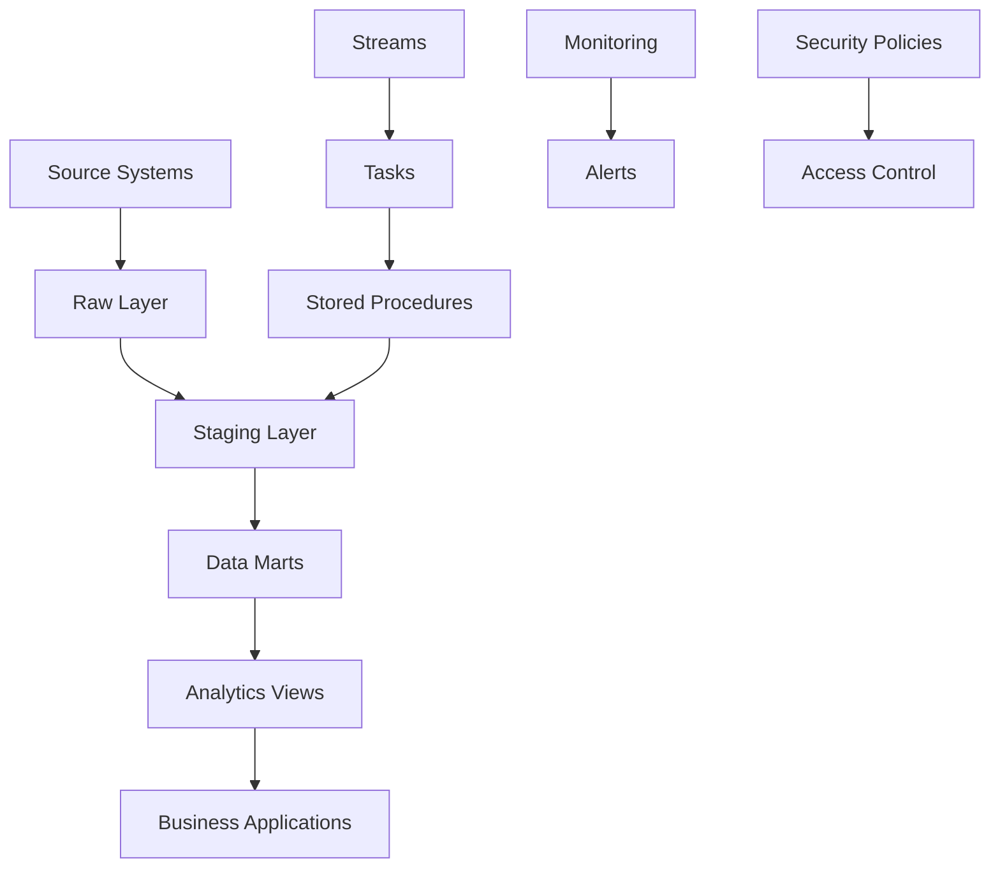

# Banking Data Platform - Data Architecture

## Overview

The Banking Data Platform implements a modern, cloud-native data architecture on Snowflake, designed specifically for banking and financial services use cases. The platform follows enterprise data engineering best practices while addressing the unique challenges of financial data processing.

## Architecture Layers

### 1. Raw Data Layer (`BANKING_RAW`)
**Purpose**: Store unprocessed data from source systems
- **Customer Data Schema**: CRM and customer profile information
- **Transaction Data Schema**: Core banking transaction records  
- **External Data Schema**: Credit bureau and third-party data

**Key Features**:
- Immutable data storage
- Full audit trail with timestamps
- Schema-on-read capabilities for flexibility
- Time Travel enabled for data recovery

### 2. Staging Layer (`BANKING_STAGING`)
**Purpose**: Cleaned, validated, and standardized data
- **Data Quality Validation**: Comprehensive quality checks and flagging
- **Standardization**: Consistent formatting and data types
- **Enrichment**: Derived fields and business logic application

**Key Features**:
- Data quality scoring and monitoring
- Incremental processing with change data capture
- Error handling and data lineage tracking

**Key Features**:
- Star schema design optimized for analytics
- Clustered tables for performance

### 4. Analytics Layer (`BANKING_ANALYTICS`)
**Purpose**: Advanced analytics and machine learning models
- **Risk Scoring Models**: Customer risk assessment
- **Fraud Detection**: Real-time anomaly detection
- **Customer Analytics**: Segmentation and behavior analysis



## Security Architecture

### Role-Based Access Control (RBAC)
- **Functional Roles**: Data Analyst, Risk Manager, Compliance Officer
- **Data Access Roles**: Customer Data Reader, PII Data Reader
- **Administrative Roles**: Data Engineer, System Administrator

### Data Protection
- **Masking Policies**: Dynamic data masking for PII fields
- **Row-Level Security**: Customer data access based on business rules
- **Encryption**: All data encrypted at rest and in transit

### Audit and Compliance
- **Query Logging**: Complete audit trail of data access
- **Data Lineage**: End-to-end tracking of data transformations
- **Compliance Monitoring**: Automated compliance reporting

## Performance Optimization

### Clustering Strategy
```sql
-- Transaction table clustered by date and customer
CLUSTER BY (transaction_date, customer_id)

-- Customer table clustered by customer segment and risk category  
CLUSTER BY (customer_segment, risk_category)
```

### Query Optimization
- Materialized views for frequently accessed aggregations
- Result caching for repetitive queries
- Partitioning on time-based columns

## Monitoring and Observability

### Key Metrics
- **Data Quality**: Percentage of valid records, completeness scores
- **Performance**: Query execution times, warehouse utilization
- **Costs**: Credit consumption, storage costs by layer
- **Security**: Access patterns, policy violations

### Alerting
- Data quality degradation alerts
- Performance threshold breaches
- Security anomalies and policy violations
- ETL pipeline failures

### Real-time Processing
- Streaming analytics with Snowflake Streams
- Event-driven architecture for immediate response

### Data Mesh Implementation
- Domain-specific data products
- Self-serve analytics platforms
- Federated governance model

